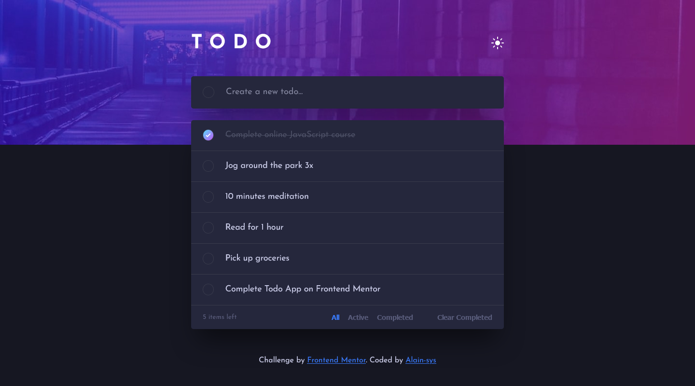
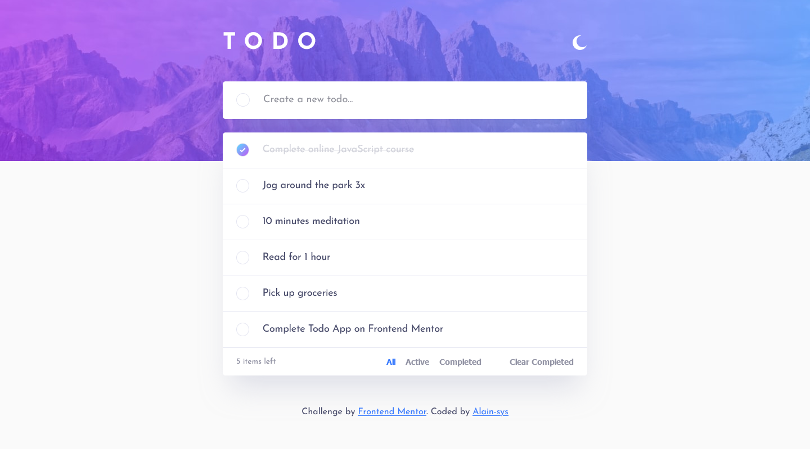
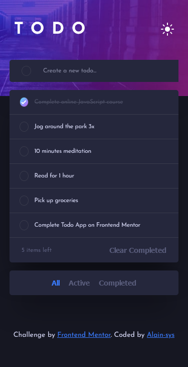
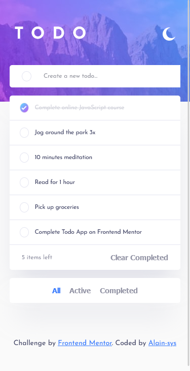

# Frontend Mentor - Todo app solution

This is a solution to the [Todo app challenge on Frontend Mentor](https://www.frontendmentor.io/challenges/todo-app-Su1_KokOW) coded by [Alain-sys](https://github.com/Alain-sys)

## Table of contents

- [Overview](#overview)
  - [The challenge](#the-challenge)
  - [Screenshot](#screenshot)
  - [Links](#links)
- [My process](#my-process)
  - [Built with](#built-with)
  - [What I learned](#what-i-learned)
  - [Continued development](#continued-development)
  - [Useful resources](#useful-resources)
- [Author](#author)
- [Acknowledgments](#acknowledgments)

## Overview

### The challenge

Users should be able to:

- View the optimal layout for the app depending on their device's screen size
- See hover states for all interactive elements on the page
- Add new todos to the list
- Mark todos as complete
- Delete todos from the list
- Filter by all/active/complete todos
- Clear all completed todos
- Toggle light and dark mode

### Screenshot

 

Desktop

  
  

  
Mobile

  

    
    
  

</details

### Links

- [Live Site URL](https://alain-sys.github.io/todo-app/)
- [Solution URL](https://www.frontendmentor.io/solutions/todoapp-in-react-vqiTCsCYf0#comment-62f522f183876a172ecf25c8)

## My process

### Built with

- [React](https://reactjs.org/) - JS library

### What I learned

I've reinforced my knowledges in React.  

### Continued development

Continue to learn React.

### Useful resources

- [React](https://beta.reactjs.org/learn)
- [MDN](https://developer.mozilla.org/fr/)
- [Stackoverflow](https://stackoverflow.com/) 

## Author

- Frontend Mentor - [@Alain-sys](https://www.frontendmentor.io/profile/Alain-sys)
- Twitter - [@Alain_sys](https://twitter.com/Alain_sys)

## Acknowledgments

Thanks to [Stéphane - smo](https://twitter.com/_smontlouis) for help me when i was stuck with the filter functionality.
